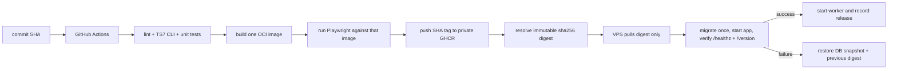

# Production Audit Remediation Plan

> 状态：**Arthur 已于 2026-07-21 批准执行。补充硬约束：现有 Xray 必须保留，2443 端口及其服务、配置和路由不得改变。**

## 1. 目标与已确认决策

本计划修复审评中除版本降级之外的全部问题，并满足以下硬约束：

- 保留 Node 26、Next.js `16.3.0-canary.90`、TypeScript `7.1.0-dev.20260720.1`，不降级、不替换。
- TypeScript/TSX 不接入 `typescript-eslint`；由项目本地 TypeScript 7 CLI（`tsc --noEmit`）负责门禁。
- Studio 只采用 mTLS 作为外层设备认证，不做 IP allowlist、Tailscale、Cloudflare Access、WebAuthn 或 TOTP。
- 登录 IP 可能因代理变化，因此 mTLS 识别“这台 Mac 的证书”，不依赖 IP。
- 现有 Xray 必须持续监听 2443；不修改其 systemd unit、配置、证书、协议、路由或防火墙规则。
- 每个修复一个独立 commit；任何 commit 合入前都必须通过它自己的定向测试和现有回归测试。
- 所有修复先在本地分支完成并验证；**全部完成前不 push**，避免 `main` 上出现半套迁移并触发中间部署。
- 全部完成后只 fast-forward `main`，push 一次，持续监控 GitHub Actions，直到镜像、部署、回滚保护和线上 `/version` 全部验证成功。
- 保留用户现有未跟踪目录 `graphify-out/`，不纳入 commit、不清理。
- 不开启 subagent。

## 2. 明确不做的内容

- 不改变三项实验版本，也不以“稳定性”为理由偷偷改 lockfile 中的版本。
- 不声称 TypeScript CLI 能替代 React Hooks/Next ESLint 规则；本次接受的边界是：JS 由 ESLint 检查，TS/TSX 由 TS7 CLI 做语法和类型门禁。
- 不增加 WebAuthn、TOTP、IP 白名单或第三方访问网关。
- 不把客户端私钥、CA 私钥、PKCS#12、生产密码、GitHub token 或 SSH 密钥写入仓库、GitHub Artifact、日志或聊天。
- 不在完成整套修复前触发生产部署。

## 3. 总体架构

### 3.1 发布链路



CI 只构建一次应用镜像。VPS 不再 rsync 源码后重新安装、重新构建，也不再拉取移动的应用基础镜像来生成另一个构件。

### 3.2 内容模型

- `articles` 只保存文章身份、`draft_revision_id`、`published_revision_id`、发布时间和精选状态。
- `article_revisions` 保存不可变标题、slug、分类、SEO、正文路径、封面等内容。
- `article_revision_tags` 保存每个修订版本的标签快照。
- 保存草稿只新增 revision 并移动 draft 指针；公开内容完全不变。
- Publish 才原子移动 published 指针、更新 FTS、写旧 URL 历史并插入持久任务。
- API 带 `expectedDraftRevisionId`；指针已变化时返回 409，禁止静默后写覆盖先写。
- 旧公开路径写入 `article_url_history`，命中后永久重定向到当前已发布路径。

### 3.3 持久任务

SQLite `jobs` 表同时承担 outbox 和队列：业务事务把待办写入数据库，独立 worker 负责 claim、重试、退避、去重、过期锁恢复和死信。

首批 job 类型：

- `proof.create`
- `proof.ots_upgrade_verify`
- `proof.wayback_capture`
- `cache.invalidate`
- `translation.article`

每个任务绑定确切 revision，而不是运行时再读取“当前文章”，避免发布后继续编辑导致证明或翻译对象漂移。

### 3.4 Studio mTLS

- 公共站点：`blog.leesaitool.com`，继续公开访问，但 `/studio`、`/studio/*` 和内部 worker 路由一律拒绝。
- 管理站点：`studio.blog.leesaitool.com`，Caddy 要求并验证客户端证书后才反代到应用。
- 客户端身份：只签发给这台 Mac；私钥导入 macOS Login Keychain。
- 服务器只保存 CA 公钥证书，不保存 CA 私钥或客户端私钥。
- 上线顺序必须是“DNS -> 服务器信任 CA -> 本机安装证书 -> 验证管理域名 -> 最后封死公共域名的 Studio”，防止把自己锁在门外。

## 4. 工作分支与提交纪律

1. 从当前 `main` 创建本地分支 `codex/audit-remediation`。
2. 计划获批后，先提交一个纯文档 commit：
   - `docs: record production audit remediation plan`
3. 按下文顺序产生 21 个修复 commit；不 squash、不把两个修复混在一个 commit。
4. 每个 commit 前检查暂存区，确保不包含 `graphify-out/` 或无关用户改动。
5. 每个 commit 后运行该任务的定向验证；阶段结束运行完整 `pnpm test`。
6. 全部通过后将本地 `main` fast-forward 到该分支，再 push `origin main`；不创建额外 merge commit。

## 5. 逐 commit 实施计划

### Commit 1 — `ci: gate TypeScript sources with the TypeScript 7 CLI`

**修复：** 当前名为 Lint 的门禁不覆盖主体 TS/TSX。

**修改：**

- `package.json`
  - 增加 `lint:js`，只运行当前 ESLint 配置。
  - 增加 `lint:ts`，运行项目本地 `tsc --noEmit`。
  - `lint` 串行运行二者；保留 `typecheck` 作为显式别名。
- `.github/workflows/deploy.yml`
  - 使用一个名称诚实的门禁步骤：`Lint JS and check TS/TSX with TypeScript 7 CLI`。
  - 删除重复执行的独立类型检查步骤。
- 不修改 `eslint.config.mjs` 的 TS 匹配范围，不引入 TypeScript parser。

**验证：**

```bash
rtk pnpm lint
rtk pnpm exec tsc --version
```

预期版本仍为 `7.1.0-dev.20260720.1`，且 TS/TSX 错误会使 `pnpm lint` 非零退出。

---

### Commit 2 — `fix(studio): preserve edits made during image uploads`

**修复：** Markdown 图片上传期间继续输入会被上传开始前捕获的旧 `value` 覆盖。

**测试先行：**

- 扩展 `tests/editor-components.test.tsx`：启动一个可控的延迟上传，上传未完成时继续输入，完成后断言最新文本和插入的 Markdown 图片都存在。
- 先运行测试并确认它在当前实现上失败。

**实现：**

- 修改 `src/components/studio/MarkdownEditor.tsx`。
- 用同步到最新 prop 的 ref（或等价的最新值读取机制）计算上传完成后的插入内容；不使用开始上传时的闭包值。
- 保持当前编辑器行为和样式，不重构编辑器。

**验证：**

```bash
rtk pnpm test -- tests/editor-components.test.tsx
```

---

### Commit 3 — `fix(studio): keep unsaved form changes when unpublishing`

**修复：** Unpublish 成功后用服务器旧数据重置整个表单。

**测试先行：**

- 扩展 `tests/editor-components.test.tsx` 或新增聚焦的 ArticleEditor 测试。
- 修改表单但不保存，执行 Unpublish，断言本地字段仍保留，只更新发布状态和服务器返回的 revision 元数据。
- 覆盖请求失败时表单和状态均不改变。

**实现：**

- 修改 `src/components/studio/ArticleEditor.tsx`。
- Unpublish 不再调用全量 `setForm(initialArticleForm(serverArticle))`。
- 保留 dirty 字段；只更新发布指针/状态及必要的并发控制字段。
- UI 明确显示“已下线，但本地未保存修改仍保留”。

**验证：**

```bash
rtk pnpm test -- tests/editor-components.test.tsx tests/studio-api.test.ts
```

---

### Commit 4 — `db: add ordered schema migrations`

**修复：** 每次启动重放当前 `schema.sql`，没有迁移版本表和有序历史。

**新增/修改：**

- 新增 `src/lib/db/migrations/`，迁移文件使用固定序号和不可变名称。
- 修改 `src/lib/db/migrate.ts`：
  - 建立 `schema_migrations(version, name, applied_at)`。
  - 每个迁移使用显式事务；只在成功后记录版本。
  - 已有生产形态数据库先识别并登记 baseline，再顺序升级。
  - fresh DB 从零依次执行所有迁移。
- `src/lib/db/schema.sql` 不再作为每次启动的可变迁移来源；要么删除，要么只保留为不可执行的当前结构参考，最终选择以减少重复真相为准。

**测试先行：** 新增 `tests/migrations.test.ts`，覆盖：

- fresh DB 全量升级。
- 旧 schema 快照升级。
- 重复运行幂等。
- 中途抛错时不记录版本，事务回滚，下次可以重试。
- 版本号和文件名不一致时拒绝启动。

**验证：**

```bash
rtk pnpm test -- tests/migrations.test.ts tests/content.test.ts tests/scaffold.test.ts
rtk pnpm db:migrate
```

本地迁移只针对测试/开发数据；不触碰生产数据库。

---

### Commit 5 — `db: rebuild FTS through a verified shadow table`

**修复：** FTS 先删后建，中断后可能永久留下空索引；缺正文文件时静默索引空字符串。

**测试先行：** 扩展 `tests/migrations.test.ts` 和 `tests/search.test.ts`：

- 从旧 FTS 结构升级，结果行数、rowid 集合与已发布文章完全一致。
- 在填充后、切换前注入中断，断言旧索引仍可用；再次迁移能完成。
- 缺失 Markdown 正文时迁移失败且不替换旧索引。
- fresh DB 和已经升级的 DB 均幂等。

**实现：**

- 有序数据迁移创建影子 FTS 表。
- 完整读取正文；文件缺失立即报错，不再返回空正文。
- 填充后核对数量和 rowid，再在同一事务内原子切换。
- 切换成功后才写入迁移版本。

**验证：**

```bash
rtk pnpm test -- tests/migrations.test.ts tests/search.test.ts tests/crash-safe-content.test.ts
```

---

### Commit 6 — `feat(content): separate immutable drafts from published revisions`

**修复：** 已发布文章的 “Save draft” 实际直接修改线上内容，并存在并发覆盖。

**数据结构：**

- 新增 `article_revisions`。
- 新增 `article_revision_tags`。
- `articles` 只保留身份、draft/published 指针、发布时间、更新时间和精选状态。
- 现有文章迁移为首个不可变 revision；已发布文章的两个指针初始指向同一 revision。
- `publication_proofs` 为后续任务预留 `article_revision_id`。

**服务/API 行为：**

- `src/lib/services/articles.ts`
  - Save：新增 revision，只条件更新 `draft_revision_id`。
  - Publish：原子把 `published_revision_id` 指向指定 draft revision。
  - Unpublish：只清空 published 指针，保留 draft。
  - 公共查询只读取 published revision；Studio 查询读取 draft，并带 published revision 元数据。
- `src/app/studio/api/articles/[id]/route.ts`
  - 接受 `expectedDraftRevisionId`。
  - 指针已变化时返回 409 和当前 revision 信息，不覆盖。
- `src/components/studio/ArticleEditor.tsx`
  - 保存成功消息与真实语义一致。
  - 409 时保留本地输入并显示冲突，不自动覆盖。
- Markdown 文件按 revision 使用唯一不可变路径；普通保存不删除仍被任一 revision 引用的文件。

**测试先行：** 新增 `tests/article-revisions.test.ts`，并扩展 `tests/studio-api.test.ts`、`tests/public-pages.test.tsx`：

- 已发布文章保存草稿后，公开正文、标题、slug、标签和 FTS 均不变。
- Publish 后公开内容一次性切换到指定 revision。
- 两个客户端基于同一旧 revision 保存时，第二个得到 409。
- Unpublish 保留草稿 revision。
- 历史数据库迁移后内容与状态不丢失。
- 删除文章会清理所有不再引用的 revision 文件。

**验证：**

```bash
rtk pnpm test -- tests/article-revisions.test.ts tests/studio-api.test.ts tests/content.test.ts tests/public-pages.test.tsx tests/search.test.ts
```

---

### Commit 7 — `feat(content): redirect historical article URLs`

**修复：** 已发布文章改变 slug/category 后旧外链直接 404。

**新增/修改：**

- 新增 `article_url_history(path, article_id, created_at)` 迁移，`path` 唯一。
- Publish 发现公开路径变化时，在切换指针的同一事务内保存旧路径。
- 修改公共文章 route：当前路径查不到时查询历史表，命中后使用永久重定向到当前 published revision。
- 草稿保存不产生公开重定向。

**测试先行：**

- 扩展 `tests/public-pages.test.tsx` 或新增 route 测试。
- 覆盖 slug 改变、category 改变、连续多次改变、草稿未发布、路径冲突和文章删除。

**验证：**

```bash
rtk pnpm test -- tests/article-revisions.test.ts tests/public-pages.test.tsx tests/seo.test.ts
```

---

### Commit 8 — `perf(cache): split public cache tags by resource`

**修复：** 任意公开变化都会清空所有公共缓存。

**修改：**

- `src/lib/services/public-content.ts` 及相关服务拆成：
  - 文章列表/分类列表 tag。
  - 单篇文章 tag。
  - settings tag。
  - proofs tag。
- Publish 只失效相关列表、旧/新文章路径和 proofs；草稿保存不失效公开缓存。
- settings 和 proof 状态变化不再清空文章正文缓存。
- 使用当前 Next 16 本地文档要求的 `cacheTag` / `revalidateTag` 形式。

**测试先行：** 扩展 `tests/cache-invalidation.test.ts`，精确断言每个动作产生的 tag 集合。

**验证：**

```bash
rtk pnpm test -- tests/cache-invalidation.test.ts tests/public-pages.test.tsx
```

---

### Commit 9 — `perf(search): bound FTS input and batch-load tags`

**修复：** 搜索 token 无上限且结果标签 N+1 查询。

**实现：**

- 搜索原始输入最多 200 个 Unicode code point，FTS token 最多 32 个。
- 搜索框同步设置 `maxLength`，服务端仍独立限制，不能只信 UI。
- 导出并复用批量文章映射/标签读取；一页结果固定为一次结果查询加一次批量标签查询。
- 保留现有搜索结果、CJK 高亮和分页语义。

**测试先行：** 扩展 `tests/search.test.ts` 和 `tests/search-page.test.tsx`：

- 超长输入和大量 token 被确定性截断，不产生超大 MATCH 表达式。
- 统计数据库 prepare/all 调用，证明标签不再逐文章查询。
- 现有 CJK 搜索和高亮不回归。

**验证：**

```bash
rtk pnpm test -- tests/search.test.ts tests/search-page.test.tsx
```

---

### Commit 10 — `perf(listings): paginate growing public and Studio lists`

**修复：** Proofs、Archive、Studio 列表和 RSS 缺少增长边界。

**实现：**

- Archive：数据库分页，每页 50 篇，保留按年分组。
- Proofs：数据库分页，每页 50 个 proof group/文章，查询总数。
- Studio：过滤和搜索下推到 SQL，再分页，每页 50 篇；不再先全量加载后在 JS 过滤。
- RSS：固定最新 50 篇。
- 非法页码归一到 1，越界页夹到最后一页；链接保留现有筛选条件。

**测试先行：** 扩展：

- `tests/archive.test.tsx`
- `tests/proofs-archive.test.tsx`
- `tests/studio-featured-article.test.tsx`
- `tests/public-limits.test.tsx`

**验证：**

```bash
rtk pnpm test -- tests/archive.test.tsx tests/proofs-archive.test.tsx tests/studio-featured-article.test.tsx tests/public-limits.test.tsx
```

---

### Commit 11 — `fix(proofs): mark OpenTimestamps anchored only after verify`

**修复：** `ots stamp` 后立即标 complete，且可能信任失败残留文件。

**状态模型：**

- `submitted`
- `pending_confirmation`
- `anchored`
- `verification_failed`

**实现：**

- `stamp` 只表示已提交；输出先写临时目录，命令成功且文件可读后原子移动。
- 不因目标 `.ots` 文件存在就信任它；数据库状态、文档哈希和命令结果必须一致。
- 后续执行 `ots upgrade`，再执行 `ots verify`。
- 只有真实 verify 成功才写 `anchored`；等待确认写 `pending_confirmation`；不可恢复错误写 `verification_failed`。
- 公共和 Studio UI 使用准确文案；pending 证明文件仍可下载。
- 测试全部注入假命令服务，不访问公共日历或比特币网络。

**测试先行：** 扩展 `tests/publication-proofs.test.ts` 和 `tests/publication-proof-studio.test.tsx`：

- stamp 成功但 verify pending。
- upgrade 后 verify 成功。
- stamp 失败且遗留部分文件。
- verify 永久失败。
- 状态到 UI 文案的映射。

**验证：**

```bash
rtk pnpm test -- tests/publication-proofs.test.ts tests/publication-proof-studio.test.tsx tests/proofs-archive.test.tsx
```

---

### Commit 12 — `feat(jobs): persist proof and cache work in SQLite`

**修复：** 发布证明、Wayback 重试和缓存失效依赖进程内 Map、timer 与响应后的当前 Web 进程。

**数据结构：** 新增 `jobs` 迁移，包含：

- type、JSON payload、dedupe key。
- `queued/running/succeeded/dead` 状态。
- attempts/max attempts、`run_at`。
- locked_at/locked_by、last_error、created_at/updated_at。

**实现：**

- 新增 `src/lib/jobs/`：事务内 enqueue、`BEGIN IMMEDIATE` claim、过期锁恢复、指数退避、死信。
- 新增 worker 入口和 `pnpm jobs:work`。
- Compose 增加与 app 使用同一镜像和数据卷的 worker service。
- Publish 事务写入精确 revision 的 proof 和 cache jobs。
- worker 处理 OTS/Wayback，进程重启后继续。
- cache job 通过仅 Docker 内网可达、带独立 secret 的应用 route 调用 Next 的 revalidation API；Caddy 对公网显式拒绝该 route。
- 删除全局 Map、`setTimeout` 和发布响应后的 `after()` 依赖。

**测试先行：** 新增 `tests/jobs.test.ts`，扩展 `tests/publication-proof-triggers.test.ts`、`tests/cache-invalidation.test.ts`：

- enqueue 与发布事务同成同败。
- 多 worker 只能 claim 一次。
- 崩溃后的 stale lock 被重新领取。
- 可恢复失败按计划重试，达到上限进入 dead。
- dedupe 不吞掉不同 revision。
- worker 重启后继续 OTS/Wayback/cache 工作。

**验证：**

```bash
rtk pnpm test -- tests/jobs.test.ts tests/publication-proof-triggers.test.ts tests/publication-proofs.test.ts tests/cache-invalidation.test.ts
```

---

### Commit 13 — `feat(translation): move bulk translation to durable jobs`

**修复：** 批量翻译在单个 HTTP 请求中顺序直接修改线上内容，中断会留下不可追踪的半完成状态。

**实现：**

- 批量 API 只扫描缺失英文的 published revisions，为每篇插入一个 `translation.article` job，返回 202、batch id 和数量。
- worker 按确切 source revision 翻译。
- source 已不再是当前 published revision 时任务安全结束为 obsolete，绝不覆盖较新的人工修改。
- 翻译成功后原子创建新 revision、切换 published 指针并插入 proof/cache jobs。
- 如果 draft 已有人工变更，只更新 published，不覆盖 draft；如果 draft 仍等于 source，可同步指向翻译后的 revision。
- Studio 按 batch id 查询 queued/running/succeeded/dead 计数并显示进度。

**测试先行：** 扩展 `tests/translation.test.ts` 和 Studio API/UI 测试：

- HTTP 请求立即返回，未在请求内执行模型调用。
- 中断/重启后剩余任务续跑。
- 重试幂等，不产生重复 revision。
- 人工新 draft 或新 publish 不被旧翻译任务覆盖。
- 成功翻译必定伴随 durable proof/cache jobs。

**验证：**

```bash
rtk pnpm test -- tests/translation.test.ts tests/jobs.test.ts tests/studio-api.test.ts
```

---

### Commit 14 — `security: make admin sessions revocable and login limits durable`

**修复：** 7 天 JWT 不可撤销；登录限流只存在单进程内存。

**实现：**

- 新增 `admin_sessions`：cookie 保存 32-byte 随机 opaque token，数据库只保存 SHA-256 hash、过期时间和撤销时间。
- 登录成功时按“单设备管理员”策略撤销此前未过期 session，再创建新 session。
- Logout 撤销当前 session；受保护 API 和 layout 每次验证数据库状态。
- proxy 只做 cookie 是否存在的快速跳转，不能作为授权依据。
- 新增持久 `login_attempts`，事务内记录、计算窗口和清理过期行；使用不可逆 IP hash，避免保留原始 IP。
- IP 变化不会影响合法登录；真正的设备边界由 mTLS 提供。

**测试先行：** 扩展 `tests/auth.test.ts`、Studio API 测试：

- 新登录使旧 token 失效。
- Logout 立即撤销。
- 过期/不存在/被篡改 token 均拒绝。
- 重启/重新加载模块后限流仍存在。
- 过期 attempt 被清理。

**验证：**

```bash
rtk pnpm test -- tests/auth.test.ts tests/studio-api.test.ts
```

---

### Commit 15 — `security: add browser policy headers and redacted access logs`

**修复：** 缺 CSP `frame-ancestors`、Permissions-Policy 和访问日志。

**实现：**

- `next.config.ts` 增加不破坏当前 Next 运行时的最小 CSP：至少包含 `frame-ancestors 'none'`、`base-uri 'self'`、`object-src 'none'`。
- 增加 Permissions-Policy，默认关闭博客不用的摄像头、麦克风、地理位置等能力。
- `deploy/Caddyfile` 启用 JSON access log、大小/时间轮转，并保留 Caddy 默认的 Authorization/Cookie 脱敏。
- 保留 HSTS、nosniff、Referrer-Policy。

**测试先行：**

- 扩展 `tests/deployment.test.ts`、`tests/public-pages.test.tsx`，验证 header 和日志配置契约。
- 在 CI 镜像 E2E 中验证真实响应 header。

**验证：**

```bash
rtk pnpm test -- tests/deployment.test.ts tests/public-pages.test.tsx
```

---

### Commit 16 — `ops: create one locked daily backup with restore drills`

**修复：** cron 与 GitHub Actions 每天各停站备份一次；无服务器级锁；失败恢复不验证；没有自动恢复演练。

**实现：**

- `scripts/backup-data.sh`、`scripts/deploy.sh` 和恢复操作使用同一个服务器 `flock` 锁。
- 只保留服务器 03:00 的每日创建任务。
- `.github/workflows/backup.yml` 只下载服务器已生成且足够新的归档，校验 manifest 后上传 Artifact；不再远程执行备份。
- 所有失败 trap 在启动 app/worker 后必须轮询 `/healthz`，恢复失败时返回明确非零状态。
- 新增 `scripts/restore-backup.sh`：先验 manifest/checksum/SQLite integrity，在临时目录恢复并迁移；默认不覆盖生产。
- 新增月度 restore-drill workflow：在隔离临时目录/容器启动当前 digest，验证 SQLite、正文文件、`/healthz` 和 `/version`，结束后清理临时资源。

**测试先行：** 扩展 `tests/backup.test.ts`、`tests/deployment.test.ts`：

- workflow 不调用备份创建脚本。
- 并发备份/部署只能一方持锁。
- 损坏 archive/manifest 拒绝恢复。
- 恢复演练不写生产目录。
- 失败恢复必须健康检查。

**验证：**

```bash
rtk pnpm test -- tests/backup.test.ts tests/deployment.test.ts
rtk bash -n scripts/backup-data.sh scripts/restore-backup.sh scripts/deploy.sh
```

---

### Commit 17 — `ops: codify the HAProxy-fronted production topology`

**修复：** 仓库 Compose 与当前生产端口拓扑互相矛盾，切换脚本会误判。

**实施中校正：** 2026-07-21 的生产只读盘点确认公网 443 实际由 HAProxy 做 SNI 分流，而不是 Xray 或 Caddy 直接监听。为保留现有 Xray 443/2443 能力，选择版本化现有 HAProxy 前置拓扑。

**版本控制的拓扑：**

- HAProxy 占用公网 TCP 80/443；80 只做 HTTPS 跳转。
- `blog.leesaitool.com` 与 `studio.blog.leesaitool.com` 的 TLS 流量转发到 Caddy `127.0.0.1:8444`。
- 其他/default TLS 流量保持转发到 Xray `127.0.0.1:9443`。
- app 和 worker 不向宿主机公开端口，只存在于 Compose 网络。
- 现有 Xray 原样保留并继续监听 2443；本计划不得修改它的 service、配置、证书、协议、路由或防火墙规则。
- HAProxy 只向 Caddy 发送 PROXY v2；Caddy 从经验证的内部来源恢复客户端地址，并显式覆盖传给 app 的 `X-Forwarded-For`。

**实现：**

- 保留 Caddy 的 `127.0.0.1:8444:443`，并把完整 HAProxy SNI 配置纳入版本控制。
- Caddy 镜像以不可变 digest 固定。
- 删除会停止或重配 Xray 的危险动作，把旧切换脚本收敛为只读 preflight；不得执行 `systemctl stop/restart/disable xray`。
- 新增版本化拓扑说明和只读 preflight；记录 80/443/2443/8444/9443 的服务归属，不新增或改写 Xray systemd unit/template。
- 部署前后校验 2443 与 9443 的 unit/config 哈希，并验证 2443 外部 TCP 可达；失败立即停止/回滚博客部署，绝不尝试“修复”Xray。
- 任何实际端口切换前先读取生产监听者、Compose 和 systemd 状态；结果与计划不同就停止，不猜。

**测试：** 扩展 `tests/deployment.test.ts`，验证 Compose、Caddy、systemd 和脚本使用同一端口契约，且 app 无宿主机端口。

**验证：**

```bash
rtk pnpm test -- tests/deployment.test.ts
rtk docker compose -f deploy/docker-compose.yml config
```

---

### Commit 18 — `security: require this Mac's client certificate for Studio`

**修复：** Studio 只有一个公网密码边界。

**仓库修改：**

- `deploy/Caddyfile`
  - `studio.blog.leesaitool.com` 使用 `client_auth require_and_verify` 和 PEM trust pool。
  - `blog.leesaitool.com/studio*` 返回 404。
  - 两个 hostname 均拒绝内部 worker route。
- `deploy/docker-compose.yml` 只读挂载 Studio CA 公钥证书。
- `deploy/production.env.example` 记录域名/证书路径变量，不含任何私钥。
- 新增证书轮换和恢复说明。

**一次性上线步骤（属于部署阶段，不在写代码时提前执行）：**

1. 确认 `studio.blog.leesaitool.com` 的 A 记录指向 `72.60.195.46`；当前它不存在。
2. 在本机临时目录生成 CA 和一个带 `clientAuth` EKU 的客户端证书。
3. 把 CA identity 和 client identity 都导入 macOS Login Keychain；CA 私钥和客户端私钥不得离开本机。
4. 仅把 CA 公钥 PEM 安装到 VPS。
5. 先启用 Studio hostname 并用临时证书文件验证：无证书握手失败，有证书返回登录页。
6. 用浏览器验证 Keychain 证书可用。
7. 最后封死公共 hostname 的 `/studio*`。
8. 删除临时明文私钥/PKCS#12；确认 Keychain identity 存在。

如果实施时没有 Porkbun DNS 权限，只暂停在第 1 步并请 Arthur 添加唯一一条明确记录；不绕过 DNS、不临时关闭 mTLS。

**测试/验收：**

- Caddy 配置验证通过。
- 无客户端证书访问 Studio hostname 失败。
- 正确证书访问成功。
- 公共 hostname `/studio` 返回 404。
- 公共站点其他页面正常。

---

### Commit 19 — `feat(ops): expose commit digest and schema at /version`

**修复：** 线上无法证明实际运行的来源版本。

**实现：**

- 新增 `src/app/version/route.ts`。
- 返回：
  - 完整 commit SHA。
  - 当前部署的 `sha256:` OCI digest。
  - `schema_migrations` 最大版本。
- commit 同时写入 OCI label 和镜像内 build metadata；运行时值与镜像值不一致时健康检查失败。
- `/version` 不缓存，不返回 secret、hostname 或内部路径。

**测试先行：** 新增 `tests/version.test.ts`，扩展 `tests/healthz.test.ts`、`tests/env.test.ts`。

**验证：**

```bash
rtk pnpm test -- tests/version.test.ts tests/healthz.test.ts tests/env.test.ts
```

---

### Commit 20 — `ci: test and publish one production OCI image`

**修复：** Runner 测试/构建的代码与 VPS 最终构建的镜像不是同一构件，现有 Playwright 未进部署门禁。

**实现：**

- `Dockerfile`
  - 仍使用 Node 26，但把基础镜像固定到实施当日验证过的官方 digest。
  - 注入完整 commit SHA 和 OCI revision label。
- `.github/workflows/deploy.yml`
  - lint/TS7/unit tests 后只构建一次生产镜像。
  - 使用临时数据卷启动**这个镜像**，运行 migrations，再对它运行现有 Playwright public + Studio E2E。
  - E2E 通过后以完整 SHA tag 推送私有 GHCR。
  - 使用 `packages: write` 的 job-scoped `GITHUB_TOKEN`；不新增长效 registry secret。
  - 记录 build-push 输出的不可变 digest。
- 镜像 build 明确传入生产 `SITE_URL=https://blog.leesaitool.com`；E2E 检查 feed、canonical 和 metadata 没有退回 localhost。
- `playwright.config.ts` 和 E2E：允许显式外部 base URL；对镜像测试时不再启动 Next dev server。
- 生产镜像 E2E 必须验证 `/healthz`、关键公共页面、Studio 登录流程、header 和 `/version` build SHA。

**测试：** 扩展 `tests/deployment.test.ts` 验证 workflow 先 E2E 后 push，且不存在第二次应用 build。

**本地/CI 验证：**

```bash
rtk pnpm test -- tests/deployment.test.ts
rtk pnpm lint
rtk pnpm test
rtk pnpm build
```

完整镜像 E2E 以 GitHub Actions Linux/amd64 结果为最终证据；本机若 Docker 可用则额外预跑，不把 macOS 无 Docker 当成跳过 CI E2E 的理由。

---

### Commit 21 — `deploy: pull immutable digests and roll back failed releases`

**修复：** VPS 重新 build，按移动 tag 部署；健康失败只退出不恢复旧镜像。

**实现：**

- `deploy/docker-compose.yml`
  - app/worker 使用 `${APP_IMAGE}`，值必须含 `@sha256:`。
  - 删除应用 `build:`。
- `scripts/deploy.sh`
  - 获取共享 maintenance lock。
  - 校验目标 digest、commit 和当前 release state，并原子备份当前 Compose/Caddy/脚本配置目录。
  - 用 job-scoped GH token 登录、拉取目标 digest、立即 logout。
  - 停止 app/worker，创建部署前 SQLite snapshot，保存前一 digest/release metadata。
  - 对目标镜像只运行一次 migration。
  - 启动 app，依次验证内部 `/healthz`、公开 `/healthz` 和 `/version` 的完整 SHA/digest/schema。
  - app 验证成功后再启动 worker。
  - 成功后原子记录当前/前一 release，并保留前一镜像用于回滚。
- Dockerfile/Compose 的常规 app 启动命令只启动服务；migration 只由部署脚本显式运行一次，app 与 worker 不再各自隐式迁移。
- 任一步失败：
  - 停止新 app/worker。
  - 原子恢复部署前数据库 snapshot。
  - 恢复上一份 Compose/Caddy/脚本配置和 release metadata，使用前一不可变 digest 启动。
  - 验证回滚后的 `/healthz` 和 `/version`。
  - 只有回滚验证成功才报告“部署失败但已恢复”；回滚也失败则让 workflow 明确红灯。
- rsync 只传部署配置/脚本，不再传应用源码供远端 build。
- 增加只允许回滚到已记录 previous release 的 `workflow_dispatch` 路径；本机部署后 mTLS 正向验证失败时可立即恢复整套上一 release，而不只是回滚 app 镜像。

**测试先行：** 扩展 `tests/deployment.test.ts`，用 fake docker/curl/ssh command harness 覆盖：

- digest 格式拒绝移动 tag。
- 正常发布。
- migration 失败回滚。
- 内部健康失败回滚。
- `/version` commit/digest/schema 不匹配回滚。
- worker 只在 app 验证后启动。
- 回滚也失败时 workflow 非零退出。

**验证：**

```bash
rtk pnpm test -- tests/deployment.test.ts tests/backup.test.ts tests/version.test.ts
rtk bash -n scripts/deploy.sh
rtk docker compose -f deploy/docker-compose.yml config
```

## 6. 阶段性完整回归

为缩短定位时间，除每个 commit 的定向测试外，在以下节点跑完整测试：

- Commit 5 后：迁移/FTS 基础完成。
- Commit 7 后：revision/URL 行为完成。
- Commit 13 后：proof/jobs/translation 完成。
- Commit 18 后：安全、备份和网络配置完成。
- Commit 21 后：最终全量验证。

每次阶段回归：

```bash
rtk pnpm lint
rtk pnpm test
rtk pnpm build
```

最终还要运行：

```bash
rtk git diff --check
rtk git status --short
rtk git log --oneline origin/main..HEAD
```

`git status` 允许只剩用户已有的 `?? graphify-out/`。

## 7. Push、GitHub Actions 与线上验收

### 7.1 Push 前

- 审计 21 个 fix commit 与计划一一对应。
- 核对 `package.json`/lockfile 中 Node、Next、TypeScript 版本未改变。
- 核对所有新 secret 名称只存在于示例/文档，值没有进入 Git 历史。
- 确认 Studio DNS 已传播、本机 Keychain 中 CA/client identities 可读、CA 公钥已安全放到服务器预定只读路径；任何一项缺失都不 push 会封死公共 Studio 的 release。
- fast-forward 本地 `main`，再执行一次最终回归。
- push `origin main` 一次。

### 7.2 Actions 监控

- 用 `gh run list` 找到该完整 SHA 的 Deploy run。
- 用 `gh run watch --exit-status` 持续等待，不以“workflow 已启动”当完成。
- 任一 job 失败：读取失败日志，按根因新增一个明确 fix commit，重新验证后 push，再从头监控新的 SHA。
- 同时监控每日备份/恢复演练的 workflow 配置检查；不会手工触发会停站的旧备份逻辑。

### 7.3 线上必须全部满足

- `https://blog.leesaitool.com/healthz` 返回 200。
- `https://blog.leesaitool.com/version` 返回本次完整 commit SHA、Actions 产出的准确 OCI digest、最新 schema version。
- GitHub Actions 记录的部署 digest与 `/version` 完全一致。
- 首页含当前 main 的 Archive/Proofs 导航和预期文章上限，排除旧部署/代理缓存。
- 公共文章、搜索、Archive、Proofs、RSS 正常。
- `https://blog.leesaitool.com/studio` 返回 404。
- 无客户端证书访问 `https://studio.blog.leesaitool.com` 失败。
- 本机 Keychain 客户端证书访问 Studio 成功，登录、保存草稿、Publish、Unpublish 正常。
- 保存已发布文章的草稿不会改变公开页面；Publish 后才改变。
- 旧 slug/category URL 永久跳转。
- worker 在运行；发布产生的 jobs 能跨 worker 重启继续并最终完成/进入可观察死信。
- OTS 刚 stamp 后显示 pending，只有 verify 成功才显示 anchored。
- 服务器当前 release state 使用 `@sha256:`，Compose 不存在应用 `build:`。
- HAProxy 占用 80/443，Caddy 只占用回环 8444，既有 Xray 原样占用 2443/9443；实际监听状态与仓库声明一致，且部署前后 Xray 配置摘要不变。
- 最新每日备份存在、manifest 可验证；恢复脚本在隔离目录演练成功。

## 8. 失败处理与停止条件

- **数据库迁移不确定：** 不在生产“试试看”。先从匿名化/复制的历史形态快照复现并通过升级、中断、重跑测试。
- **生产端口与计划不符：** 停止部署，报告实际 `ss/systemd/docker compose` 证据，更新计划并重新请 Arthur 批准网络变更。
- **Studio DNS 无权限：** 只请求 Arthur 添加 `studio.blog.leesaitool.com A 72.60.195.46`；其余工作可继续，但最终部署不宣布完成。
- **mTLS 正证书尚未准备好：** 不 push 会封死公共 Studio 的 release。部署后本机正向握手若仍失败，立即触发 previous release 全量回滚，再修配置。
- **新版本健康失败：** 自动恢复部署前 DB snapshot 和上一 digest；不手工在坏版本上继续改生产数据。
- **GitHub Actions 或线上证据不一致：** 任务保持未完成，继续修复和监控。

## 9. 审阅时需要 Arthur 明确批准的内容

批准本计划即表示同意以下四项会改变生产边界的决定：

1. 生产只读盘点后采用 HAProxy 前置：HAProxy 占用公网 80/443，Caddy 位于回环 8444，既有 Xray 原样保留在 2443/9443；任何 Xray service/config/证书/路由均不改变。生产 HAProxy reload 前展示精确 diff 再确认。
2. 新增 `studio.blog.leesaitool.com`，并在确认本机证书可用后封死公共域名的 `/studio*`。
3. 将文章表迁移到 immutable revisions；部署失败时允许脚本恢复部署前数据库 snapshot。
4. 应用镜像发布到私有 GHCR，VPS 只拉完整 digest，不再远端 build。

Arthur 已明确批准本计划，并补充要求 Xray/2443 保持原样；按此修订版开始执行。

## 10. 实施时采用的官方依据

- GitHub Actions 发布容器与 `GITHUB_TOKEN` 权限：<https://docs.github.com/en/actions/tutorials/publish-packages/publish-docker-images>
- GitHub Container Registry 与 digest 拉取：<https://docs.github.com/en/packages/working-with-a-github-packages-registry/working-with-the-container-registry>
- Docker digest 的不可变语义：<https://docs.docker.com/dhi/core-concepts/digests/>
- OpenTimestamps `stamp`、`upgrade`、`verify` 生命周期：<https://github.com/opentimestamps/opentimestamps-client>
- SQLite 显式事务：<https://www.sqlite.org/lang_transaction.html>
- SQLite 在线备份 API：<https://www.sqlite.org/backup.html>
- SQLite FTS5：<https://www.sqlite.org/fts5.html>
- Caddy mTLS：<https://caddyserver.com/docs/caddyfile/directives/tls>
- Caddy access log：<https://caddyserver.com/docs/caddyfile/directives/log>
- Next.js 16/TS7/cache 行为以仓库 `node_modules/next/dist/docs/` 的当前本地文档为准。
